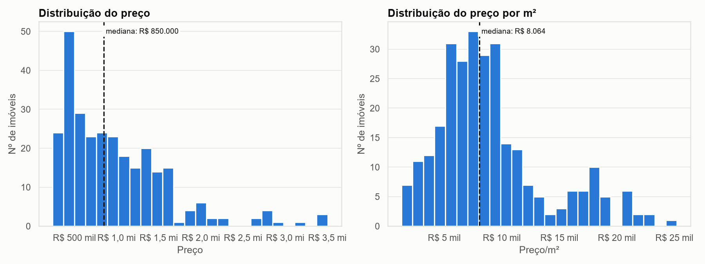
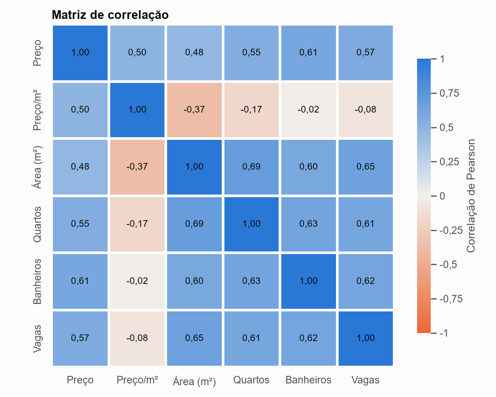
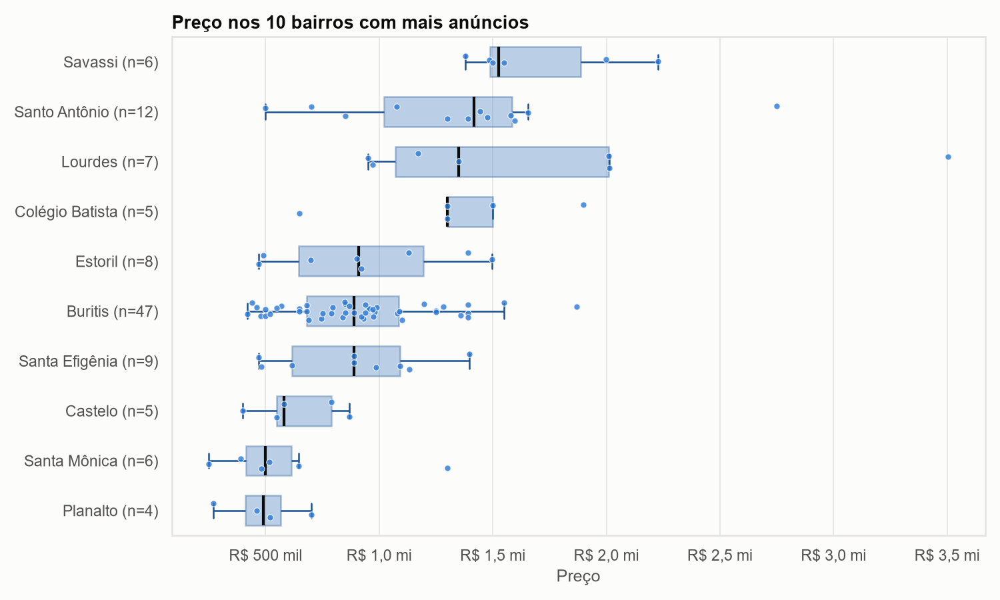
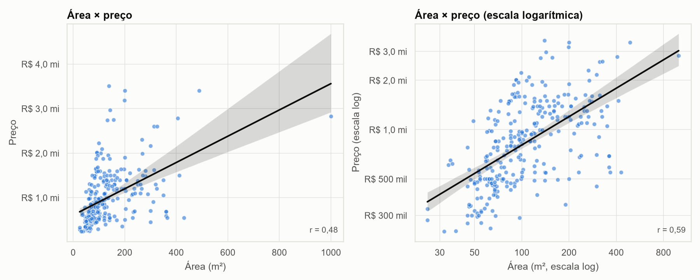
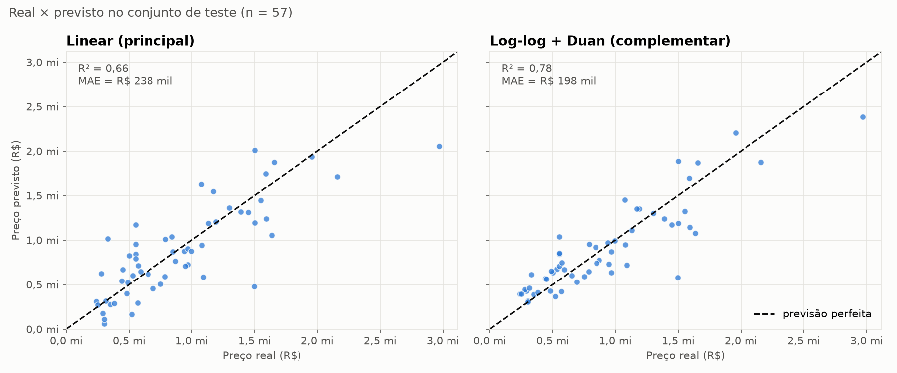
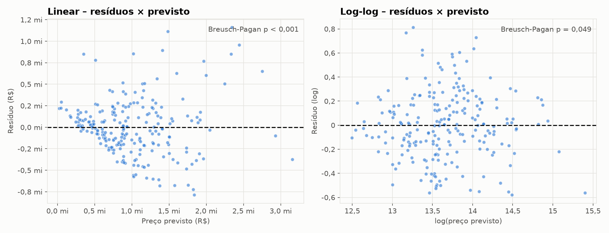
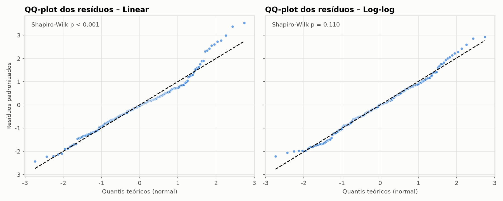

# Avaliação 1 - Ciência de dados - Web scraping e regressão linear para previsão de preços de imóveis

## Fonte de dados e método de coleta

Os dados foram coletados do portal **VivaReal**, com foco em apartamentos, casas e coberturas à venda em Belo Horizonte (MG), em 05/10/2026. Como o site monta os resultados com JavaScript, a coleta foi feita com a biblioteca **Playwright** (Node.js), no script `scraper.js`. O script abre a busca, espera os cartões dos imóveis carregarem, rola a página e lê de cada cartão o preço, a área, os quartos, os banheiros, as vagas, o bairro, o tipo e o link do anúncio. Foram percorridas as 10 primeiras páginas de resultados (300 cartões, dos quais 286 eram imóveis únicos), com pausas aleatórias de 2,5 a 5,5 segundos entre as páginas.

## Estatísticas descritivas da amostra

Antes da análise, o script `limpeza.py` tratou os dados assim:

- Conversão de tipos: textos como "R$ 1.200.000" e "75 m²" foram transformados em números (1200000,0 e 75,0);
- Remoção do único imóvel sem preço;
- Imputação de vagas: os 11 anúncios sem o campo de vagas receberam 0, pois o site omite esse campo quando o imóvel não tem garagem;
- Remoção de 4 outliers extremos, fora do intervalo de Q1 − 3×IQR a Q3 + 3×IQR no preço e no preço por m²;
- Criação da variável preço por m², obtida pela divisão do preço pela área.

A amostra final tem **281 imóveis em 104 bairros**: 199 apartamentos, 35 coberturas e 47 casas. O bairro Buritis sozinho concentra 16,7% dos anúncios.

| Variável | Média | Mediana | Desvio-padrão | Mínimo | Máximo |
|---|---|---|---|---|---|
| Preço (R$) | 985.735 | 850.000 | 615.644 | 239.069 | 3.504.000 |
| Área (m²) | 128,3 | 96,0 | 99,1 | 25,0 | 1.000,0 |
| Preço/m² (R$) | 9.031 | 8.064 | 4.725 | 1.279 | 25.209 |
| Quartos | 2,8 | 3 | 0,9 | 1 | 7 |
| Banheiros | 2,3 | 2 | 1,1 | 1 | 8 |
| Vagas | 2,1 | 2 | 1,3 | 0 | 10 |

## Gráficos da EDA

{width=13cm}

_Figura 1 – Distribuição do preço e do preço por m², com a mediana._

{width=6.6cm} {width=8.6cm}

_Figura 2 – Matriz de correlação (Pearson). Figura 3 – Preço nos 10 bairros com mais anúncios._

{width=13cm}

_Figura 4 – Área × preço com reta de tendência, em escala linear e log-log._

**Quais variáveis parecem mais correlacionadas com o preço?** Banheiros (0,61), vagas (0,57) e quartos (0,55) aparecem antes da área (0,48) na correlação de Pearson. A área, porém, fica subestimada: na correlação de Spearman ela chega a 0,62. Isso acontece por causa das casas grandes com preço por m² baixo (R$ 4,5 mil/m² nas casas, contra R$ 9,3 mil nos apartamentos). A localização também pesa muito: a mediana de preço vai de R$ 490 mil (Planalto) a R$ 1,5 milhão (Savassi).

**A relação é linear?** Só em parte. A variação do preço cresce junto com a área e existem poucos imóveis muito caros puxando a média. Em escala logarítmica a relação fica mais reta (a correlação entre área e preço sobe de 0,48 para 0,59), por isso também testamos um modelo com log do preço.

## Especificação do modelo e métricas

O modelo escolhido é uma **regressão linear múltipla (OLS)** que prevê o preço a partir de área, quartos, banheiros, vagas, tipo do imóvel (casa ou apartamento), regional da cidade e lançamento. A localização entrou por **One-Hot Encoding**: primeiro testamos os bairros, mas como a maioria tinha poucos anúncios, os bairros foram agrupados nas 9 regionais administrativas de BH, o que deu resultados melhores e mais estáveis. Também incluímos uma interação entre área e casa, porque nas casas a área informada parece ser a do terreno, e a variável **lançamento** (imóveis novos ou na planta, identificados pelo link do anúncio), que só foi descoberta depois da primeira avaliação no teste.

A amostra foi dividida em treino (80%, 224 imóveis) e teste (20%, 57 imóveis). As escolhas foram feitas por validação cruzada (5 partes, repetida 3 vezes) usando só o treino. Comparamos a regressão linear com **Ridge** e **Lasso** (que ficaram praticamente empatados, então mantivemos a linear, mais simples), com um modelo **log-log** (log do preço e da área, com a correção de Duan para converter as previsões de volta para reais) e, só como referência, com um **Random Forest**.

| Modelo | R² (CV) | RMSE (CV) | MAE (CV) | R² (teste) | RMSE (teste) | MAE (teste) |
|---|---|---|---|---|---|---|
| Linear, sem `lancamento` (1ª) | 0,584 | R$ 405.155 | R$ 284.986 | 0,599 | R$ 349.131 | R$ 243.669 |
| Log-log, sem `lancamento` (1ª) | 0,357 | R$ 503.546 | R$ 294.193 | 0,671 | R$ 316.113 | R$ 219.193 |
| **Linear OLS (principal)** | 0,674 | R$ 358.607 | R$ 265.451 | 0,658 | R$ 322.444 | R$ 238.265 |
| Linear Ridge | 0,672 | R$ 359.633 | R$ 264.370 | – | – | – |
| Linear Lasso | 0,666 | R$ 363.095 | R$ 267.071 | – | – | – |
| Log-log + Duan (complementar) | 0,589 | R$ 402.288 | R$ 245.018 | 0,782 | R$ 257.115 | R$ 197.789 |
| _Random Forest (referência)_ | 0,682 | R$ 354.248 | R$ 244.192 | – | – | – |

A regressão linear explica cerca de 2/3 da variação dos preços e quase empata com o Random Forest, um modelo bem mais complexo. No teste, o log-log foi melhor; mesmo assim mantivemos a linear, porque o critério foi definido antes do teste e, no treino, ela errou menos nos imóveis grandes. As duas primeiras linhas mostram a primeira avaliação, antes da variável de lançamento; como essa variável entrou depois, o segundo resultado no teste não é totalmente independente.

**Multicolinearidade (VIF):** quartos, banheiros, vagas e regionais ficaram abaixo de 3. A área ficou em 9,98, mas isso vem da própria interação área × casa; separando a área por tipo, o valor cai para 3,33. Os resíduos não têm variância constante (teste de Breusch-Pagan), por isso usamos erros-padrão robustos (HC3).

{width=10.5cm}

_Figura 5 – Real × previsto no conjunto de teste._

{width=10.5cm}

_Figura 6 – Resíduos × previsto (ajuste no treino)._

{width=10.5cm}

_Figura 7 – QQ-plot dos resíduos padronizados._

## Interpretação dos coeficientes

Mantidas as demais características iguais:

- **Área:** cada m² adicional eleva o preço do apartamento em cerca de **R$ 4.475** (intervalo de 95%: R$ 2.934 a R$ 6.016). Nas casas, a área quase não muda o preço, o que reforça que ali ela é a área do terreno;
- **Banheiro:** cada banheiro a mais acrescenta cerca de **R$ 131 mil** (ou 10%);
- **Vaga:** cada vaga a mais acrescenta cerca de **R$ 164 mil** (ou 14%);
- **Localização:** um imóvel na regional Centro-Sul custa cerca de **R$ 399 mil (32%) a mais** que um igual na regional Oeste; no Norte, cerca de R$ 249 mil (30%) a menos;
- **Casa:** com a mesma área, uma casa vale cerca de 29,5% menos que um apartamento;
- **Lançamento:** imóveis novos ou na planta custam cerca de **R$ 598 mil (72%) a mais**. Parte disso pode ser erro de medida, já que o anúncio mostra o preço "a partir de";
- **Quartos** não tiveram efeito significativo: com a área fixa, um quarto a mais só divide o mesmo espaço.

## Limitações: amostra pequena, viés de anúncios, seleção geográfica

- **Preço pedido não é preço de venda:** usamos o valor anunciado, que costuma ficar acima do valor fechado no negócio;
- **Amostra pequena:** 281 imóveis, abaixo dos 300 sugeridos, vindos só das 10 primeiras páginas do site;
- **Viés de anúncios:** o Buritis concentra 16,7% da amostra, o que reflete a ordem do site e não o mercado; nas casas, a área informada parece ser a do terreno;
- **Seleção geográfica:** a amostra cobre só Belo Horizonte, e o agrupamento dos bairros em regionais foi feito manualmente;
- **Variáveis que faltaram:** o cartão do anúncio só traz preço, área, cômodos, vagas e endereço, então o modelo não sabe a idade do prédio nem como o imóvel está por dentro;
- **Precisão:** o modelo erra tipicamente de 20% a 25% e, em 4 dos 57 imóveis do teste, previu valores abaixo do menor preço do treino.

## Considerações éticas sobre scraping

- **robots.txt e termos de uso:** verificados manualmente em 05/10/2026. O robots.txt bloqueia para robôs as buscas com os parâmetros `onde=` e `tipos=`, usados pelo scraper, e a cláusula 9.1 dos Termos de Uso do Grupo OLX (dono do VivaReal) proíbe usar robôs para copiar elementos dos sites. **A coleta, portanto, não respeitou o robots.txt nem os termos de uso;**
- **Proteção contra robôs:** o site bloqueou o navegador automático (erro 403). O scraper abriu o navegador visível e escondeu a marca de automação, contornando essa proteção;
- **LGPD:** só foram coletados dados dos imóveis, o endereço e o link, sem nomes, telefones ou e-mails. Como endereço e link podem identificar o anunciante, a base não será publicada;
- **Carga e uso acadêmico:** pausas de 2,5 a 5,5 segundos entre as páginas. A coleta só se justifica como exercício acadêmico em pequena escala e não deve ser repetida dessa forma; o caminho certo seria pedir autorização ao site ou usar uma fonte que permita a coleta.
